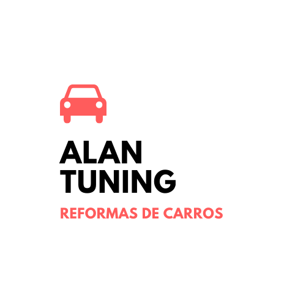

  

<h1 align="center">Alan Tuning</h1> 

É uma Landing Page de um serviço oferecido por uma empresa.

Tabela de conteúdos
=================
<!--ts-->
   * [Sobre](#Sobre)
   * [Tabela de Conteudo](#tabela-de-conteudo)
   * [Instalação](#instalacao)
   * [Como usar](#como-usar)
      * [Pre Requisitos](#pre-requisitos)
   * [Tecnologias](#tecnologias)
   * [Midia](#midia)
<!--te-->

<h4 align="center"> 
	✔️  Pronto  ✔️
</h4>

## Sobre

 É uma Landing Page de uma reforma feita por uma empresa em um carro (Fusca) onde mostra a capacidade do serviço oferecido. 

## Tabela de conteudo

- [X] Fotos 
- [X] Video
- [X] Pagina Principal
- [X] Uso do BootStrap

## Instalação

## Como usar

Para utilizar desse projeto basta seguir os seguintes passos.

1) Ter esse codigo em sua maquina e para isso basta digitar em seu terminal:

<code>git clone https://github.com/Taunt-byte/LandingPage-Elon.git</code>

2) Depois disso basta abrir o arquivo index.html em qualquer navegador de sua escolha.

OU

1) Para ver essa landing page você tambem pode utilizar o link abaixo:

<code>https://taunt-byte.github.io/LandingPage-Elon/</code>

## Pre-requisitos

Para "rodar" esse projeto em sua maquina basta ter os seguintes itens em sua maquina.

1) Git
2) Uma boa IDE

## Tecnologias

<table>
    <tr>
    <td>CSS</td>
    <td>BootStrap</td>
    </tr>
    <tr>
    <td>3.*.*</td>
    <td>5.*.*</td>
    </tr>
</table>

## Midia

+ Caso o video do youtube esteja indisponivel na hora da visualização a uma pasta com o mesmo video basta rodar que você ira ver.